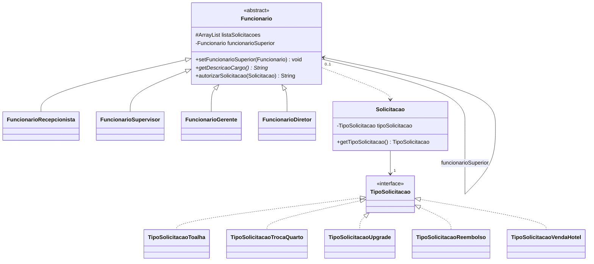

# padrao-chain-of-responsibility

Solicitações de hóspedes em um Hotel: (Recepcionista → Supervisor → Gerente → Diretor)

Diagrama de classes:

```mermaid
classDiagram
    class Funcionario {
        <<abstract>>
        #ArrayList listaSolicitacoes
        -Funcionario funcionarioSuperior
        +setFuncionarioSuperior(Funcionario) void
        +getDescricaoCargo()* String
        +autorizarSolicitacao(Solicitacao) String
    }
    class FuncionarioRecepcionista
    class FuncionarioSupervisor
    class FuncionarioGerente
    class FuncionarioDiretor

    class Solicitacao {
        -TipoSolicitacao tipoSolicitacao
        +getTipoSolicitacao() TipoSolicitacao
    }
    class TipoSolicitacao {
        <<interface>>
    }
    class TipoSolicitacaoToalha
    class TipoSolicitacaoTrocaQuarto
    class TipoSolicitacaoUpgrade
    class TipoSolicitacaoReembolso
    class TipoSolicitacaoVendaHotel

    Funcionario <|-- FuncionarioRecepcionista
    Funcionario <|-- FuncionarioSupervisor
    Funcionario <|-- FuncionarioGerente
    Funcionario <|-- FuncionarioDiretor
    Funcionario --> "0..1" Funcionario : funcionarioSuperior
    Funcionario ..> Solicitacao
    Solicitacao --> "1" TipoSolicitacao
    TipoSolicitacao <|.. TipoSolicitacaoToalha
    TipoSolicitacao <|.. TipoSolicitacaoTrocaQuarto
    TipoSolicitacao <|.. TipoSolicitacaoUpgrade
    TipoSolicitacao <|.. TipoSolicitacaoReembolso
    TipoSolicitacao <|.. TipoSolicitacaoVendaHotel
```
# padrao-chainofresponsability
